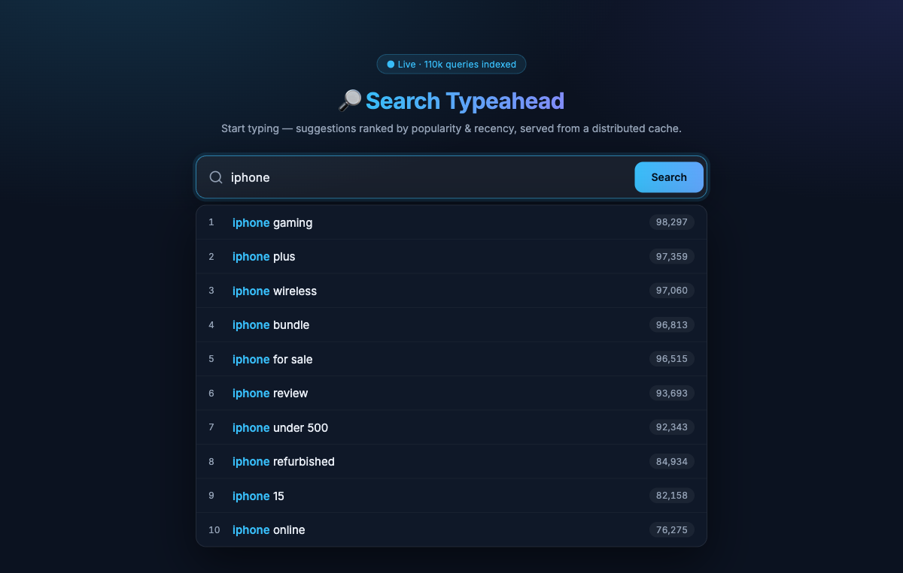

# Search Typeahead System

A simple, self-contained search-typeahead (autocomplete) system: suggests popular
queries as you type, records searches, ranks by popularity **and** recency, serves
suggestions from a distributed in-memory cache (consistent hashing), and reduces
database load with batched writes.

Built deliberately minimal: **one Node/Express file + one HTML file + one dataset
generator.** No database server, no Redis, no build tools, no frontend framework.




---

## 1. Setup & Run

```bash
cd search-typeahead
npm install            # installs express
node generate-data.js  # builds data.json (110,000 queries) — run once
node server.js         # starts http://localhost:4000
```

Open <http://localhost:4000> in a browser.

> Port is `4000` (set in `server.js`, `PORT`). Change it there if needed.

---

## 2. Dataset

- **Source:** synthetically generated by `generate-data.js` (the assignment allows any
  dataset and permits deriving counts). Kept synthetic so the project is fully
  self-contained and reproducible — no downloads.
- **Format:** `data.json` = `[{ "query": "iphone 15", "count": 85000 }, ...]`
- **Size:** 110,000 unique queries (exceeds the 100k minimum).
- **How counts are derived:** queries are built from brand/product/topic + modifier
  combinations; counts follow a Zipf-like distribution (shorter/head terms are more
  popular) plus seeded noise. The RNG is seeded, so the dataset is identical on every run.

---

## 3. Architecture

```
 Browser (public/index.html)
   |  debounced GET /suggest?q=&rank=         POST /search        GET /trending
   v
 Express server (server.js)
   |
   |-- /suggest --> [ Distributed Cache ] --hit--> return
   |                   (3 cache nodes,            
   |                    consistent hashing)       
   |                       |  miss               
   |                       v                     
   |                 [ Primary Store ] (Map = "the DB") --> compute top 10, cache it
   |
   |-- /search  --> [ Batch Buffer ] --(flush by size OR timer)--> Primary Store
   |                                                              + recent-activity
   |                                                              + cache invalidation
   |
   |-- /trending --> recent-activity scores (time-decayed)
   |-- /cache/debug --> which node owns a prefix + hit/miss
   |-- /stats    --> cache hit rate, write reduction, latency p50/p95/p99
```

### Components

| Component | Where | What it does |
|---|---|---|
| **Primary store** | `store` (a `Map`) | The "database". Holds `query -> {count}`. We count reads/writes against it. |
| **Distributed cache** | `cacheNodes` (3 `Map`s) | Each node simulates a separate cache server. Caches `top-10 suggestions` per prefix. TTL = 30s. |
| **Consistent hashing** | `ring`, `nodeForKey()` | FNV-1a hash + ring with 50 virtual nodes per cache node. Decides which node owns a prefix. |
| **Batch writer** | `buffer`, `flush()` | Buffers search submissions, aggregates repeats, flushes by size (50) or timer (2s). |
| **Recency / trending** | `recent` (a `Map`) | Time-decayed activity score (half-life 60s) for trending + recency ranking. |

---

## 4. API Documentation

| API | Purpose | Example |
|---|---|---|
| `GET /suggest?q=<prefix>&rank=basic\|recency` | Up to 10 prefix matches, sorted | `/suggest?q=iph&rank=recency` |
| `POST /search` `{ "query": "..." }` | Records a search, returns dummy response | `{ "message": "Searched", "query": "iphone" }` |
| `GET /trending` | Top queries by recent activity | `/trending` |
| `GET /cache/debug?prefix=<p>&rank=...` | Owner node + HIT/MISS for a prefix | `/cache/debug?prefix=iph` |
| `GET /stats` | Cache hit rate, write reduction, latency | `/stats` |

**`/suggest` response:**
```json
{
  "prefix": "iphone", "rank": "basic", "source": "cache",
  "node": "cache-node-2", "latencyMs": 0.03,
  "suggestions": [ { "query": "iphone gaming", "count": 98297 }, ... ]
}
```

Edge cases handled: empty input, missing `q`, mixed-case (normalized to lowercase),
and prefixes with no matches (returns `[]`).

---

## 5. Design Choices & Trade-offs

**Why an in-memory Map as the "database"?**
Simplicity. The assignment focuses on the *data-system design* (caching, hashing,
batching), not on a specific DB engine. The Map gives us a clean place to count
reads/writes and prove the batching win. Trade-off: **not durable** — data is lost on
restart and reloaded from `data.json`.

**Suggestion lookup = linear scan over the store, then cache.**
A prefix scan of 110k entries takes single-digit milliseconds in JS. The cache makes
repeated prefixes effectively free (~0.03ms). This keeps the code trivial to explain.
Trade-off: cold (uncached) lookups are O(n); a trie would make them O(prefix length)
but adds a lot of code. For this scale, cache-in-front is the better simplicity/latency
deal.

**Consistent hashing.** Node chosen by `FNV-1a(prefix)` mapped onto a ring with 50
virtual nodes per cache node (virtual nodes = even key spread). The storage key inside
a node also includes the rank mode (`basic` vs `recency`) so the two rankings don't
overwrite each other. Benefit of consistent hashing: adding/removing a cache node only
remaps ~1/N of keys, not all of them.

**Cache freshness.** TTL of 30s, **plus** active invalidation on every flush — when a
query's count changes, we drop any cached prefix that the query starts with, so stale
rankings don't linger.

**Recency-aware ranking (the 20% part).**
`score = count + RECENCY_WEIGHT * recentScore(query)` where `recentScore` is a
time-decayed sum of recent searches (half-life 60s).
1. *Tracked* via the `recent` map, updated on each flush.
2. *Affects ranking* through the weighted term above (same `/suggest` API, `rank=recency`).
3. *Avoids permanent over-ranking* because the recent score **decays exponentially** —
   a query that was hot for a minute fades back to its base popularity.
4. *Cache* is invalidated on flush so ranking changes show up.
   Trade-off: freshness vs latency — a shorter TTL / faster flush = fresher but more
   compute; longer = faster but staler.

**Batch writes (the other 20%).**
Search submissions go into a buffer and are aggregated (repeated queries merged) before
being written. Flush triggers: buffer reaches 50, or every 2s.
- *Write reduction:* without batching, every search = 1 DB write. With batching, N
  searches collapse to "number of distinct queries per flush". See `/stats`
  (`writeReductionPct`).
- *Failure trade-off:* if the process crashes **before a flush**, buffered counts are
  lost (at-most-once). That's acceptable for popularity counters where approximate is
  fine. A durable queue / write-ahead log would fix it at the cost of complexity.

---

## 6. Performance Report

Measured locally via `/stats` (numbers vary per run):

- **Cache:** uncached `/suggest` ≈ **5–8 ms**; cached ≈ **0.03 ms** (~200x faster).
  Hit rate climbs with repeated prefixes.
- **Latency:** `/stats` reports p50 / p95 / p99 for `/suggest`.
- **Write reduction:** in a 60-search test, 61 submissions → 33 DB writes
  (**~46% fewer writes**); reduction grows as repeat queries increase.
- **Consistent hashing:** `/cache/debug` shows prefixes spread across all 3 nodes,
  e.g. `iph→node-2`, `sams→node-0`, `lap→node-1`.

**One-command proof:** with the server running, `npm run demo` exercises all of the
above and writes a log to [`demo-output.log`](demo-output.log) — cache speedup,
consistent-hashing routing, basic-vs-recency ranking, and batch write reduction.

Reproduce manually:
```bash
# cache speedup
curl "localhost:4000/suggest?q=iphone"   # source: store (slow)
curl "localhost:4000/suggest?q=iphone"   # source: cache (fast)

# batch write reduction
for i in $(seq 1 60); do curl -s -XPOST localhost:4000/search \
  -H 'Content-Type: application/json' -d '{"query":"iphone 15"}' >/dev/null; done
curl localhost:4000/stats

# recency vs basic ranking
curl "localhost:4000/suggest?q=iphone&rank=basic"
curl "localhost:4000/suggest?q=iphone&rank=recency"
```

---

## 7. Files

```
search-typeahead/
├── generate-data.js   # builds data.json (110k queries)
├── data.json          # generated dataset
├── server.js          # Express server: all backend logic
├── public/index.html  # UI (search box, dropdown, trending, keyboard nav)
├── screenshots/       # demo screenshots
└── README.md
```
