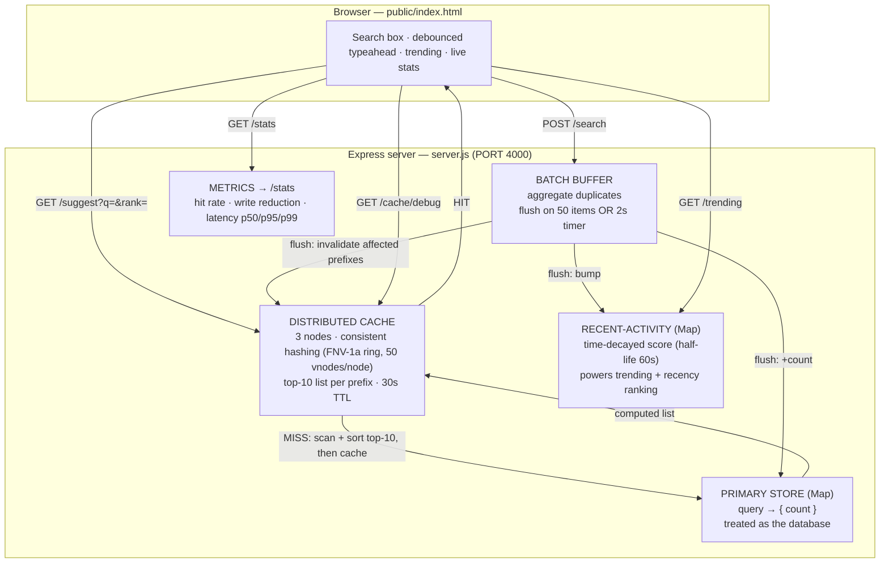

# Project Report — Search Typeahead System

**Repository:** https://github.com/kushaltalati/search-typeahead
**Stack:** Node.js + Express backend, vanilla HTML/CSS/JS frontend. No database server,
no Redis, no build tools — everything runs in-process for a simple, self-contained demo.

---

## 1. Architecture

### Diagram



### Component responsibilities

| Component | In code | Responsibility |
|---|---|---|
| **Primary store** | `store` (a `Map`) | The "database". Holds `query → {count}`. Reads/writes against it are counted. |
| **Distributed cache** | `cacheNodes` (3 `Map`s) | Each node simulates a separate cache server. Caches the top-10 suggestion list per prefix. Entries expire after 30 s (TTL). |
| **Consistent hashing** | `ring`, `nodeForKey()` | FNV-1a hash on a ring with 50 virtual nodes per cache node; decides which node owns a prefix. |
| **Batch writer** | `buffer`, `flush()` | Buffers search submissions, merges duplicates, flushes by size (50) or timer (2 s). |
| **Recency / trending** | `recent` (a `Map`) | Time-decayed activity score (half-life 60 s) powering trending + recency-aware ranking. |
| **Metrics** | `/stats` | Cache hit rate, write reduction, suggestion latency percentiles. |

**Suggestion flow:** request → check the owning cache node → **HIT** returns instantly;
**MISS** scans the store for prefix matches, sorts by score, takes the top 10, caches
that list, and returns it.

**Search flow:** `POST /search` returns `{"message":"Searched"}` immediately and pushes
the query into the batch buffer. On the next flush the store count is updated, the
recent-activity score is bumped, and affected cached prefixes are invalidated.

---

## 2. Dataset — Source & Loading

- **Source:** synthetically generated by `generate-data.js`. The assignment permits any
  dataset and allows deriving counts, so a synthetic set keeps the project fully
  self-contained (no downloads) and reproducible.
- **Size:** **110,000** unique queries (exceeds the 100k minimum).
- **Format:** `data.json` = `[{ "query": "iphone 15", "count": 85000 }, ...]`
- **How counts are derived:** queries are built from brand / product / topic + modifier
  combinations; counts follow a Zipf-like distribution (shorter, head terms are more
  popular) plus seeded noise. The RNG is seeded (`seed = 42`), so the dataset is identical
  on every run.

**Loading instructions:**

```bash
cd search-typeahead
npm install            # installs express
node generate-data.js  # builds data.json (110,000 queries) — run once
node server.js         # loads data.json into the in-memory store, serves :4000
```

On boot, `loadDataset()` reads `data.json` and populates the `store` Map
(logged: `Loaded 110000 queries into primary store.`).

---

## 3. API Documentation

Base URL: `http://localhost:4000`

### `GET /suggest?q=<prefix>&rank=basic|recency`
Returns up to 10 prefix-matching suggestions. `rank` defaults to `recency`.

```json
{
  "prefix": "iphone", "rank": "basic", "source": "cache",
  "node": "cache-node-2", "latencyMs": 0.03,
  "suggestions": [ { "query": "iphone gaming", "count": 98297 } ]
}
```
- `source`: `cache` (hit) or `store` (computed). `node`: owning cache node.
- Edge cases: empty/missing `q` → `{ "suggestions": [] }`; input is lowercased
  (mixed-case safe); no matches → `[]`.

### `POST /search`  — body `{ "query": "..." }`
Records a search (queued for batched write) and returns the dummy response.
```json
{ "message": "Searched", "query": "iphone" }
```
- New query → inserted with an initial count; existing query → count incremented.

### `GET /trending`
Top queries by recent (time-decayed) activity.
```json
{ "trending": [ { "query": "java tutorial", "recentScore": 22.38 } ] }
```

### `GET /cache/debug?prefix=<p>&rank=basic|recency`
Shows which cache node owns the prefix and whether it is cached.
```json
{ "prefix": "iphone", "rank": "recency", "ownerNode": "cache-node-2",
  "status": "HIT", "expiresInMs": 29911,
  "ring": [ { "node": "cache-node-0", "cachedKeys": 0 } ] }
```

### `GET /stats`
Performance numbers used in the report below.
```json
{
  "cache": { "hits": 9, "misses": 34, "hitRatePct": 20.9, "nodes": [] },
  "batchWrites": { "searchesReceived": 62, "dbWriteOps": 7, "flushCount": 6,
                   "pendingInBuffer": 0, "writeReductionPct": 88.7 },
  "db": { "reads": 34, "writes": 7, "storeSize": 110001 },
  "suggestLatencyMs": { "samples": 43, "p50": 3.788, "p95": 9.95, "p99": 13.755 }
}
```

---

## 4. Design Choices & Trade-offs

**In-memory `Map` as the primary store.**
Chosen for simplicity — the assignment targets the *data-system design*, not a specific
DB engine. The Map gives a clean place to count reads/writes and prove the batching win.
*Trade-off:* not durable; data is lost on restart and reloaded from `data.json`.

**Prefix lookup = linear scan, then cache.**
A scan of 110k entries takes only single-digit milliseconds, and the cache makes repeat
prefixes effectively free (~0.01 ms). *Trade-off:* cold lookups are O(n); a trie would
make them O(prefix length) but adds significant code. At this scale, cache-in-front is
the better simplicity/latency deal.

**Consistent hashing for the distributed cache.**
Node chosen by `FNV-1a(prefix)` on a ring with 50 virtual nodes per cache node (virtual
nodes spread keys evenly). *Benefit:* adding/removing a cache node only remaps ~1/N of
keys — with plain `hash % N`, changing node count reshuffles *every* key and wipes the
cache. The storage key also includes the rank mode so `basic` and `recency` lists don't
overwrite each other.

**Cache freshness.** 30 s TTL **plus** active invalidation on every flush: when a query's
count changes, cached prefixes that the query starts with are dropped, so stale rankings
don't linger. *Trade-off:* freshness vs latency — shorter TTL/faster flush = fresher but
more recompute.

**Recency-aware ranking.** `score = count + WEIGHT × recentScore`, where `recentScore` is
a time-decayed sum of recent searches (half-life 60 s). *Why decay:* it prevents a query
that was hot for a short burst from staying on top forever — as activity stops, the boost
fades back to base popularity. The same `/suggest` API serves both modes via `rank=`.

**Batch writes.** Submissions go into a buffer, duplicates are aggregated, and the buffer
flushes on size (50) or timer (2 s). *Benefit:* far fewer store writes (see §5).
*Trade-off (failure mode):* if the process crashes before a flush, buffered counts are
lost (at-most-once). Acceptable for approximate popularity counters; a durable
log/queue would fix it at the cost of complexity.

---

## 5. Performance Report

Measured locally via `/stats` and the bundled demo (`npm run demo` → `demo-output.log`).
Representative run on this machine (110,000-query dataset):

| Metric | Result |
|---|---|
| **Suggestion latency — cold (store)** | ~3.55 ms |
| **Suggestion latency — warm (cache)** | ~0.007 ms |
| **Cache speedup** | **~500×** faster on a hit |
| **Latency p50 / p95 / p99** | 3.79 / 9.95 / 13.76 ms (cold-dominated sample) |
| **Cache hit rate** | 20.9% in the demo's mostly-unique traffic; rises sharply with repeated prefixes |
| **Batch write reduction** | 50 repeated searches → **2 DB writes (88.7% fewer)** |
| **Overall this run** | 62 searches → 7 DB writes (88.7% fewer) |
| **Consistent hashing** | prefixes spread across all 3 nodes (e.g. `laptop→node-1`, `iphone→node-2`) |

**Ranking demonstration (basic vs recency):** after searching `iphone 15` a few times,
the prefix `iphone` returns:
- `BASIC`   top: iphone gaming, iphone plus, iphone wireless, iphone bundle, iphone for sale
- `RECENCY` top: **iphone 15**, iphone gaming, iphone plus, iphone wireless, iphone bundle

`iphone 15` is low by all-time count but jumps to #1 under recency, then fades as its
recent score decays — confirming the windowing logic works.

**Reproduce:** `node server.js` in one terminal, then `npm run demo` in another. The full
log is committed as `demo-output.log`.

---

*See also: `README.md` (setup), `EXPLAIN.md` (plain-English walkthrough), `demo-output.log`
(raw measurement log).*
